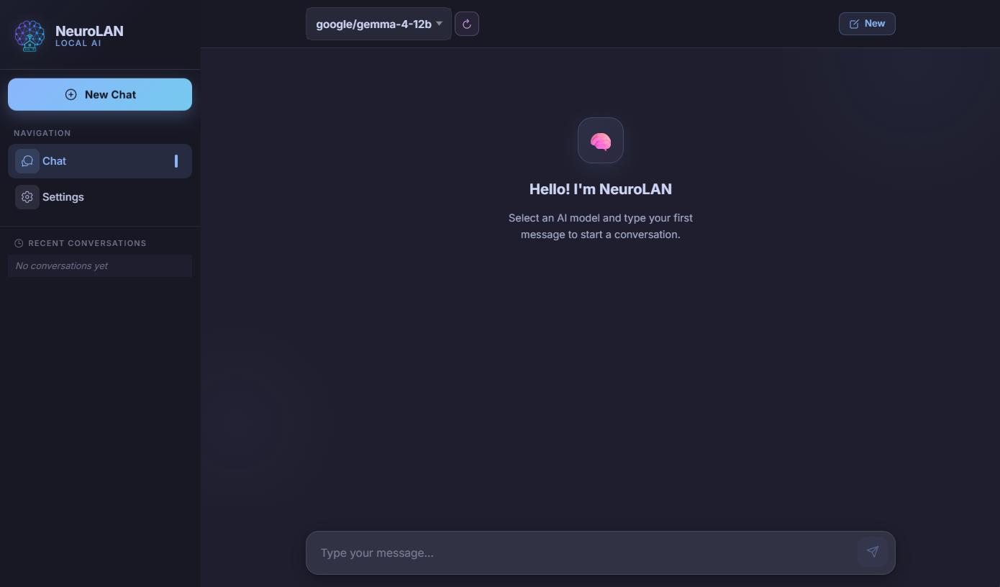
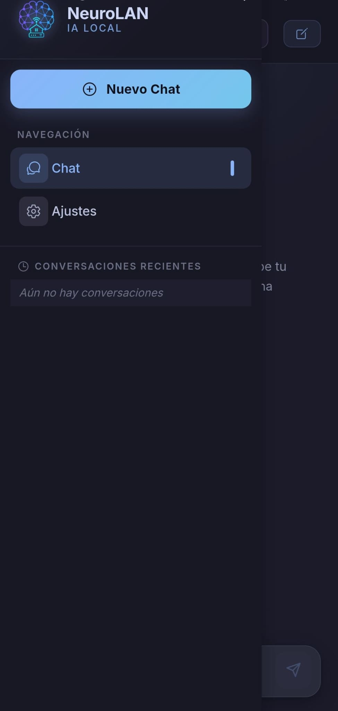
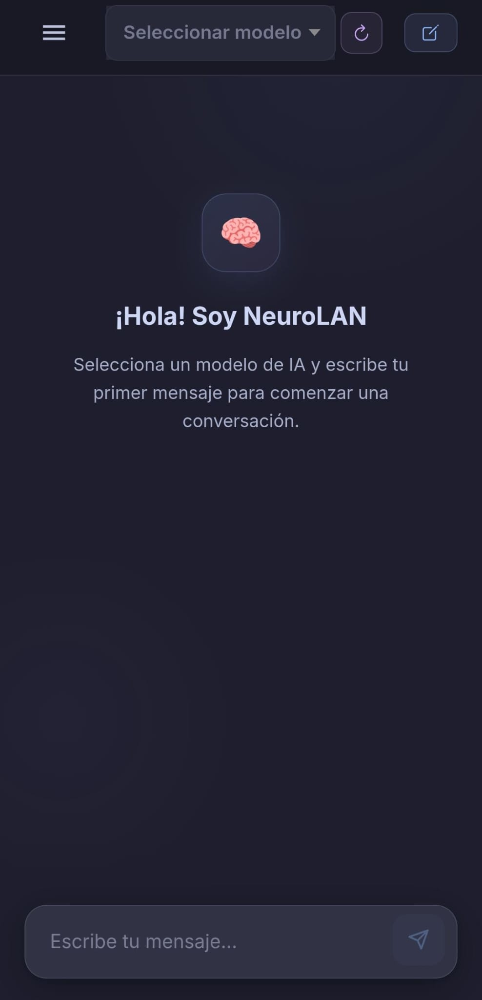

<p align="right">
  <a href="./README.es.md">🇪🇸 Leer este README en español</a>
</p>

<p align="center">
  
</p>

# NeuroLAN

NeuroLAN is a cross-platform chat application (Ionic + Angular) for running conversations with local AI models over your home network. It connects to any server that implements the OpenAI-compatible API — including **LM Studio**, **Ollama**, and similar tools — without sending any data to the cloud.

> No subscriptions. No cloud. Your hardware, your models, your data.

## Screenshots

**Web**

<p align="center">
  
</p>

**Mobile**

<p align="center">
  
  &nbsp;&nbsp;&nbsp;
  
</p>

## Features

- **OpenAI-compatible**: works with LM Studio, Ollama, and any server exposing `/v1/chat/completions`.
- **Model selector**: pick which loaded model to talk to without leaving the chat.
- **Conversation history**: conversations are saved locally and persist between sessions.
- **Cross-platform**: runs in the browser, and as an Android app via Capacitor.
- **Multilingual UI**: English and Spanish out of the box.
- **Response timing**: shows how long each response took.
- **Privacy-first**: no telemetry, no accounts, no external requests.

## Project structure

```text
src/
 ├── app/
 │    ├── app.component.*           # Root component and side menu
 │    ├── app.routes.ts             # App routing
 │    ├── core/
 │    │    ├── models/
 │    │    │    ├── openai.model.ts        # OpenAI API request/response interfaces
 │    │    │    └── conversation.model.ts  # Conversation data model
 │    │    └── services/
 │    │         ├── openai.ts             # OpenAI-compatible API client
 │    │         ├── conversation.ts       # Conversation storage and management
 │    │         └── settings.ts          # App settings (base URL, language, etc.)
 │    └── pages/
 │         ├── chat/                # Main chat view
 │         ├── conversations/       # Conversation list (sidebar)
 │         └── settings/            # Settings screen
 ├── assets/
 │    └── i18n/                     # Translation files (en.json, es.json)
 └── theme/
```

## Requirements

- **Node.js** 18 or later.
- A running local inference server with an OpenAI-compatible API:
  - [LM Studio](https://lmstudio.ai) (default port: `1234`)
  - [Ollama](https://ollama.com) (default port: `11434`)

## Getting started

```bash
# Install dependencies
npm install

# Start the dev server
npm start
```

Open `http://localhost:8100` in your browser. Before you can chat, go to **Settings** and enter the URL of your local inference server (e.g. `http://192.168.1.10:1234` for LM Studio or `http://192.168.1.10:11434` for Ollama). Once saved, the model selector will populate and you can start a conversation.

See [docs/setup.md](docs/setup.md) for a detailed step-by-step guide for LM Studio and Ollama.

## Technologies

- **[Ionic](https://ionicframework.com/)** — cross-platform UI framework.
- **[Angular](https://angular.dev/)** — component-based web framework.
- **[TypeScript](https://www.typescriptlang.org/)** — typed JavaScript.
- **[Capacitor](https://capacitorjs.com/)** — native Android/iOS bridge.
- **[LocalForage](https://localforage.github.io/localForage/)** — offline storage.
- **[ngx-markdown](https://github.com/jfcere/ngx-markdown)** — Markdown rendering in chat.

## Android build

```bash
# 1. Build the Angular app
npm run build

# 2. Sync with Capacitor
npx cap sync

# 3. Open in Android Studio
npx cap open android
```

## Releases

Releases are generated automatically via GitHub Actions when you push a tag:

```bash
git tag v1.1.0
git push origin v1.1.0
```

Each release includes the web build (`web-build.zip`), a debug APK, and an unsigned release APK.

## Roadmap

See [docs/TODO.md](docs/TODO.md) for the full list of planned features.

## Architecture notes

See [docs/architecture.md](docs/architecture.md) for an overview of the design decisions and how the codebase is organized.

## License

[GPL-3.0](LICENSE)
